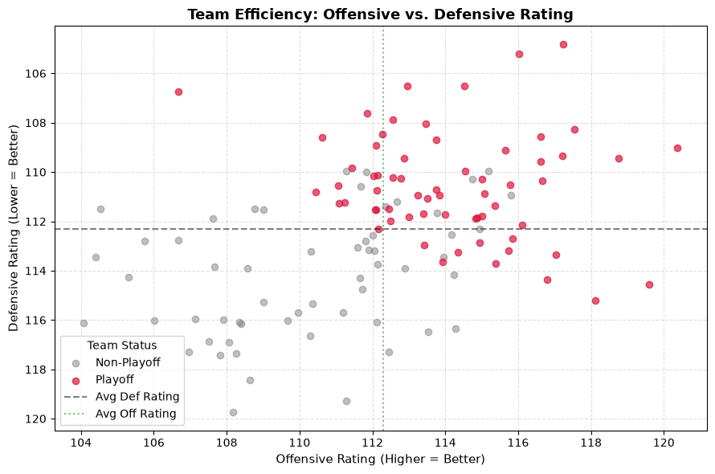
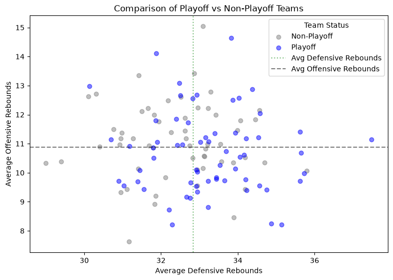

# nba-playoff-analysis

# Description
This project analyzes data from 4 NBA seasons(2022-2026) to determine the statistical drivers between teams contending for the playoffs and teams who are not. By utilizing **SQL data cleaning**, **Pandas data manipulation**, **scipy t tests**, and **matplotlib visualization** this project determines whether post-season qualification relies on individual scoring volume, team efficiency, ball control, or rebounding.

# Methods
**SQL** (Aggregation, Joins, Data Validation)
**Python**(Scipy, Pandas, Matplotlib)

# Findings
### 1. Player efficiency: volume vs. efficiency
* **Question:** Do playoff players simply take more shots, or are they significantly more efficient?
* **Findings:** Key playoff and non-playoff players (minutes>15) have identical usage rates ($p = 0.9422$). However, playoff caliber players exhibit higher efficiency with a better true shooting and effective field goal percentage ($p < 0.0001$) and lower turnover rates ($p = 0.0001$).
* **Takeaway:** Players contending in the playoffs are defined by efficiency and ball security not usage rate alone.

### 2. Team efficiency: offense vs. defense
* **Question:** Is offensive or defensive rating separating playoff contenders?
* **Findings:** Both Offensive and Defensive Ratings show statistically significant gaps ($p < 0.0001$) in playoff teams vs non-playoff teams.
* **Takeaway:** A balance of elite offense and defense are key factors when determining team success.

### 3. Team ball control: assists vs. turnovers
* **Question:** Do playoff teams win through superior ball movement and turnover minimization?
* **Findings:** Both playoff and non-playoff teams show almost identical amounts of assists per game, however the gap between the two are the amount of turnovers. Playoff teams commit almost one less turnover than non-playoff teams.
* **Takeaway:** Ball security and passing quality elevate team success.

### 4. Rebounding dominance: defensive vs. offensive rebounds
* **Question:** Does crashing the glass on offense or securing defensive stops create a bigger postseason gap?
* **Findings:** Defensive rebounding exhibits a much stronger, statistically significant separation ($p < 0.001$) compared to offensive rebounding.
* **Takeaway:** Stopping opponents from gaining second chance points is much more of a driving factor in team success compared to generating second chance points.

# Graphical anaylsis

### Scoring efficiency vs. volume

**Analysis** The usage rate of non-playoff and playoff players overlap, however the red dots cluster around 55%-60% while the gray dots drop below.

## Offensive vs. defensive rating

**Analysis** The 4 quadrant graph allows us to view that playoff teams tend to cluster in the upper right quadrant where both offense and defense are above average. It is also worth noting playoff teams not in this quadrant are among the elites in terms of offensive or defensive rating, showing that teams can compensate not being above average in both offensive and defensive rating by specializing on one side of the court.

## Turnovers vs assists per game
<
img src="images/assists_vs_turnovers.png" width="750" alt="assists vs turnovers">

**Analysis** Playoff teams cluster below the average turnover line with most post-season rosters hovering around 12-14 turnovers per game. The top left quadrant where teams have high turnovers and low assists per game mainly consists of non-playoff teams.

## Offensive vs defensive rebounds

**Analysis** Playoff teams tend to be on the right side of the graph, grabbing an above average amount of defensive rebounds. In the top right quadrant where teams grab both above average offensive and defensive rebounds, this are is dominated by playoff teams. A possible reason for non-playoff teams to have a higher amount of offensive rebound could be tied into player efficiency, simply put, non-playoff teams have more inefficient players allowing for more opportunities to grab offensive rebounds, while playoff teams are more likely to make there shots giving them less opportunities for offensive rebounds. 
